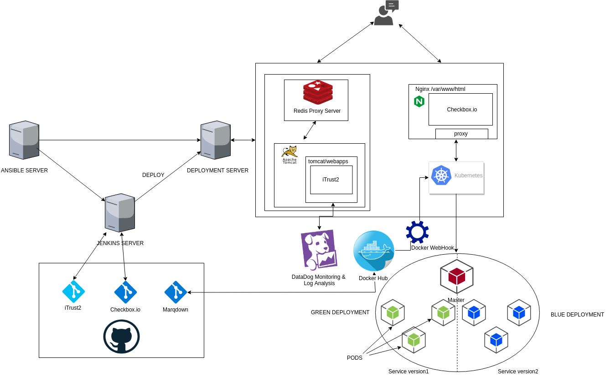
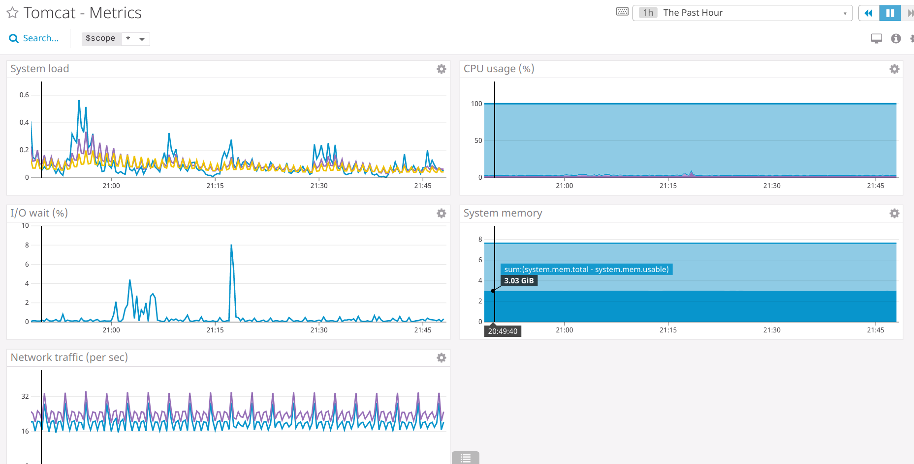

# Phases of Pipeline:

#### Configuration and Build: https://github.com/AkshayRaul/DevOps-Pipeline/tree/CM+Build
#### Test and Analysis: https://github.com/AkshayRaul/DevOps-Pipeline/tree/Test+Analysis
#### DEPLOYMENT, INFRASTRUCTURE, and something SPECIAL: https://github.com/AkshayRaul/DevOps-Pipeline/tree/Deployment+Infrastructure+Special

# DEPLOYMENT, INFRASTRUCTURE, and something SPECIAL
### Team 6: 
#### Team members - Unity Id
      Ashwin Risbood - arisboo
      Cameron Nelson - cenelso3
      Akshay Raul - araul
      Shwetha Kalyanaraman -skalyan
#### Contributions
    Ashwin Risbood - Setting up nginx for checkbox.io, extracting marqdown microservice and its respective dockerfile, setting up Kubernetes' blue-green deployments, metallb loadbalancer and a simple reciever for Dockerhub webhook.
    Shwetha Kalyanaraman - Setting up proxy server for feature flags in iTrust and wrote ansible scripts to configure redis.
    Akshay Raul- Setup Jenkins prod pipeline, wrote ansible scripts to configure kubernetes and servers(tomcat & nginx). Setup tomcat and nginx. Setup and configured Datadog agent for monitory & log processing
    Cameron Nelson - Assisted in setup of git hooks for iTrust and Checkbox.io in setting up nginx server for checkbox.io. Worked on configuring file transfers from iTrust jenkins server to iTrust deployment server (i.e. war file and SQL sample users). Lead the finalization of final screencast. 

#### Instructions to Setup:
```
1  git clone https://github.ncsu.edu/araul/Project_DevOps.git
2. cd Project-DevOps
3. cd ansible-srv
4. ansible-playbook initialSetup.yml 
7. ansible-playbook -i inventory main.yml
8. cd ./digitalOceanVM
9. node main.js
10. cd ../deployment-srv
11. ansible-playbook -i inventory main.yml
```

#### Setup Instructions

Once the repository is clone, the sub modules of `iTrust` and `checkbox.io` are also cloned. To set these repositories with configuration files so that these projects are ready to be built, run the following playbook
```
$ ansible-playbook initialSetup.yml
```
#### Architecture Diagram


### Deployment Components

#### Get DigitalOcean VM IP:
In the `digitalOceanVM` directory, run `node main.js` to provision a VM in DigitalOcean. Once provisioned it gets the IP address of the newly created VM and outputs it to the inventory file of `deployment-srv`. 

```js
async function setIp(client,dropletId){

        var dropletInfo = await client.dropletInfo(parseInt(dropletId));
        var ip_address= dropletInfo.networks.v4[0].ip_address;

        // create inventory file 
        var inventoryString=`[web]
      deployment-srv ansible_host=${ip_address} ansible_ssh_user=root ansible_python_interpreter=/usr/bin/python3       ansible_ssh_private_key_file=/keys/do_rsa1
      [web:vars]
      ansible_python_interpreter=/usr/bin/python3`

        fs.writeFile('../deployment-srv/inventory', inventoryString, function (err) {
                if (err) throw err;
                console.log('Saved!');
        });

}
```

#### Deployment Git Hooks:
In Jenkins srv, ansible installs `GitHub` plugin which is used as a listener to the incoming POST requests whenever a push takes place on the GitHub repository. 
- To setup GitHub hooks, head over to your repository on `GitHub > Click Settings> Hooks`. Add the endpoint of the Jenkins Server as `http://JENKINS_URL/github-webhook` with the `JenkinsFile` location. 
- The endpoint `github-webhook` is necessary for the plugin. In Jenkins, for the Jobs which want to be triggered ont the push, add the repository to the SCM with its credentials(if any) like this:

- Check `Github Polling SCM` 


#### Feature Flag:
We used the feature of redis-cli to set two keys: 

1. Feature name
2. Status of the Feature to enable or disable

The ansible script starts by installing redis,starts redis server, starts the node file to redirect accordingly.

Every link of iTrust goes through a proxy server which will check from redis key-value pair.

After checking it will redirect accordingly if the url is disabled or not.
Suppose urlKey: `iTrust_logentries`, then it maps to `/v1/api/log_entries` and it's status set to be `True`
Then if the logs will be disabled on the frontend. If the status is False, then the feature is enabledT


#### Infrastructure Components:
Marqdown microservice: https://github.ncsu.edu/arisboo/marqdown 

Dockerhub image repository for marqdown: ashwinrisbood/marqdown https://hub.docker.com/r/ashwinrisbood/marqdown

Webhook reciever: https://github.com/ashwinrisbood/dockerhub-webhook

### Special Milestone:

#### 1. Blue Green Deployment

We implemented a blue green style deployment for our marqdown kubernetes cluster.

To achieve blue-green:
- Two different deployments were created on kubernetes, each using a different base image from dockerhub.
- Implementing a load balancer using metallb for our bare metal kubernetes. (https://github.com/danderson/metallb)
- creating a simple webhook reciever using expressJs, to update the kubernetes cluster on a change in the base image on dockerhub. 

#### 2. Datadog Monitoring and Log Processing

Datadog collects Tomcat and JVM metrics exposed by JMX via the JMXFetch plugin. This plugin is built into Datadog’s Java integrations, including the Tomcat integration. To begin collecting this data, you will need to install the Datadog Agent on your host. The Agent is open source software that forwards metrics, events, and logs from your hosts to Datadog.[source: DataDog Documentation]

Documentation: https://www.datadoghq.com/blog/analyzing-tomcat-logs-and-metrics-with-datadog/

The agent is installed via Ansible using the following commands:
- Agent:
```bash
DD_API_KEY=<YOUR_API_KEY> bash -c "$(curl -L https://raw.githubusercontent.com/DataDog/datadog-agent/master/cmd/agent/install_script.sh)"
```
- Make changes to collect logs:
```yaml
## Log Section (Available for Agent >=6.0)

logs:
  - type: file
    path: /opt/tomcat/logs/localhost_access_log*.txt
    source: tomcat
    service:tomcat
  - type: file
    path: /opt/tomcat/logs/catalina*.log
    source: tomcat
    service: tomcat
```
Similarly, other metrics can be monitored by adding/modifying the metrics in the `conf.yaml` file inside `tomcat.d` directory of `Datadog-agent` found in `/etc/datadog-agent`




##### ScreenCast:
[Click here](https://bit.ly/2GEQ0rs) to watch the demo

[Click here](https://www.youtube.com/watch?v=l7p_iOtMug0) to watch overall project throughout the semester
